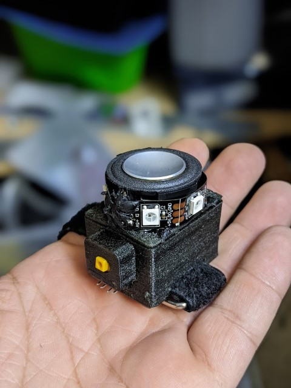
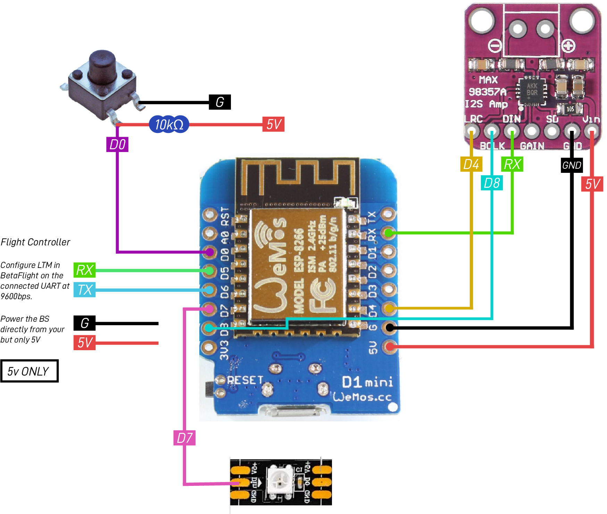

```
______  _____ _____ _____ _____ ______ _____  ___  ___  ___ ___________
| ___ \|  _  |_   _/  ___/  __ \| ___ \  ___|/ _ \ |  \/  ||  ___| ___ \
| |_/ /| | | | | | \ `--.| /  \/| |_/ / |__ / /_\ \| .  . || |__ | |_/ /
| ___ \| | | | | |  `--. \ |    |    /|  __||  _  || |\/| ||  __||    /
| |_/ /\ \_/ / | | /\__/ / \__/\| |\ \| |___| | | || |  | || |___| |\ \
\____/  \___/  \_/ \____/ \____/\_| \_\____/\_| |_/\_|  |_/\____/\_| \_|
```

This is the firmware and associated files for the Botscreamer as seen on Botgrinder TV.

The Botscreamer is a tiny 3W speaker system that reacts on the attitude of your quad and is light enough to be mounted on top of your lipo. Did I say it's loud? It's freaking loud! 

It comes with 4 pre-loaded sounds (simple 16bit PCM wav files) and even has a music maker mode that reacts on yaw (14 notes across 360 degrees).



# Build it

Get the parts below:

1x ESP8266 Mini D1 (https://amzn.to/34F7Ud2)

1x MAX98357 I2S amplifier (https://amzn.to/3rzCkqs)

1x 4ohm/3w speaker with a large magnet (https://amzn.to/3Hz32op)

1x Tactile button 

1x 10k resistor (for the button)

1x 4-wire that connects to your FC

If you want LED lights, you also need a some WS8212 RGB LED's.

# Wire up

See the picture below how to wire everything up. This expects you used the parts above.



## WARNING

Make sure you power the ESP8266 ONLY with 5V or you will burn the ESP8266.

# Print it

There is a case in the `/3d` folder that fits all parts. Print with TPU95 with 20% infill to keep it light but still strong. The PCB material will stiffen it up. The case has cut outs on the bottom allowing you to use a up to 20mm strap.

# Deploy it

Use the Arduino IDE to deploy the code to the ESP8266 and use the SPIFFS tool to upload the files.

# Fly it

There are 4 modes selectable through the button and the fifth mode is the music maker mode. Most modes have a minimum requirement of 1.2s in order to work which prevents false triggers. So you have to hold it for a least that time in order to enable.

| Mode | What | Comment | 
| ----  | ------ | ------------- | 
| 1 | Goat | Screams like a goat on roll (upside down) | 
| 2 | Human | Scary lady screaming like no other day on roll (upside down) |
| 3 | Duck | A rapid duck noise on roll (upside down) |
| 4 | Police | Police lights mode. Pitch forward to turn on sound and pitch backward to turn it off |
| 5 | Music Maker Mode | See below |

# Music Maker Mode

In Music Maker Mode the BS is playing a continues sound that can be modified using YAW. It plays 14 notes across the 360 degree. It runs on a static 100bpm so you have about 600ms to turn your quad to modify the sound which is plenty enough. 

`Make some tunez!`